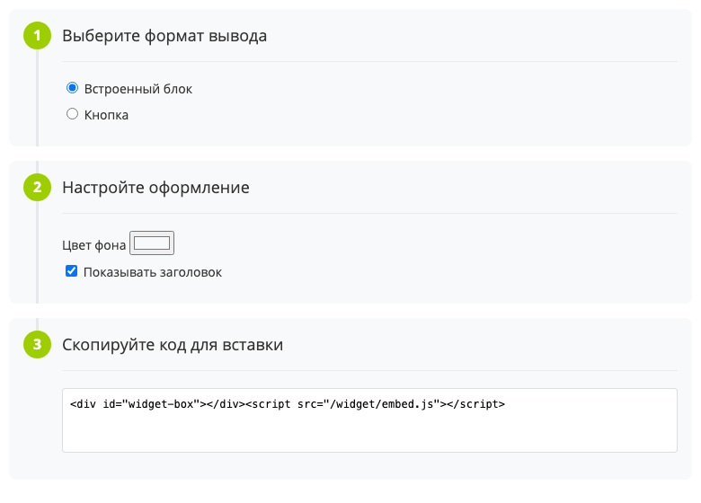
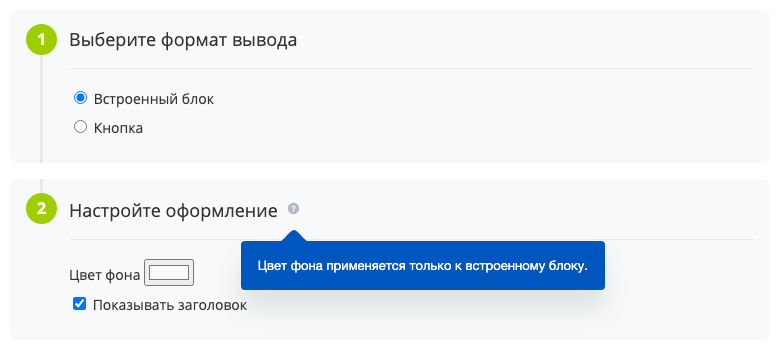
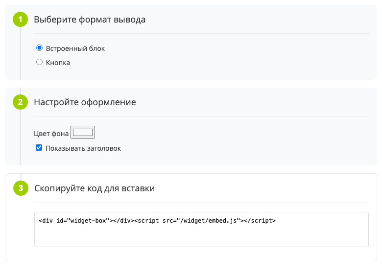

Список шагов — вертикальная цепочка пронумерованных блоков, соединенных линией. В блоке есть номер шага, заголовок и произвольное содержимое.

Список размещают там, где пользователь идет сверху вниз: подключает внешний сервис, собирает код для вставки, настраивает инструмент в первый раз. Все шаги видны сразу, переключения между ними нет.

Расширение только отрисовывает переданные блоки. Содержимое шага готовит разработчик, и в его работу расширение не вмешивается: не хранит состояние шагов, не помечает их выполненными и не отправляет события.

В Bitrix Framework за список шагов отвечает расширение `ui.stepbystep`. Оно экспортирует один класс `StepByStep`.

## Подключить расширение

Если вы выводите список из PHP, загрузите расширение `ui.stepbystep`.

```php
\Bitrix\Main\UI\Extension::load('ui.stepbystep');
```

Вместе с расширением подключаются его зависимости: `main.core`, `main.core.events`, `ui.hint` и `ui.fonts.opensans`. Загружать их отдельно не нужно.

Если вы работаете в модульном JavaScript, импортируйте класс `StepByStep` из `ui.stepbystep`.

```js
import { StepByStep } from 'ui.stepbystep';
```

После загрузки расширения тот же класс доступен глобально как `BX.UI.StepByStep`.

Серверной части у расширения нет: ни PHP-класса, ни компонента.

## Собрать список шагов

Чтобы показать список на странице, выполните основные действия:

1. Загрузите расширение `ui.stepbystep`.

2. Подготовьте контейнер, в который встанет список.

3. Опишите шаги и передайте их в параметре `content`.

4. Создайте экземпляр `StepByStep` и вызовите метод `init()`.

Передайте в конструктор `StepByStep` объект с двумя параметрами:

-  `target` — контейнер, в который метод `init()` вставляет собранный список. Тип `HTMLElement`. По умолчанию `null`.

-  `content` — массив с описанием шагов. Его формат разобран в разделе [Описать шаги](#describe-steps). По умолчанию `null`.

**Пример.** Разметка выводит пустой контейнер списка.

```html
<div id="widget-setup-steps"></div>
```

**Пример.** Список из трех шагов настройки виджета выводится в узел `widget-setup-steps`.

```js
import { StepByStep } from 'ui.stepbystep';
import { Tag } from 'main.core';

const formatStep = Tag.render`
    <div>
        <label><input type="radio" name="format" value="inline" checked> Встроенный блок</label>
        <label><input type="radio" name="format" value="button"> Кнопка</label>
    </div>
`;

const designStep = Tag.render`
    <div>
        <label>Цвет фона <input type="color" name="background" value="#f8f9fa"></label>
    </div>
`;

const codeStep = Tag.render`<textarea readonly rows="3"></textarea>`;

const steps = new StepByStep({
    target: document.getElementById('widget-setup-steps'),
    content: [
        { html: [{ header: 'Выберите формат вывода', node: formatStep }] },
        { html: [{ header: 'Настройте оформление', node: designStep }] },
        { html: [{ header: 'Скопируйте код для вставки', node: codeStep }] },
    ],
});

steps.init();
```

{width=780px height=560px}

Метод `init()` собирает разметку и вставляет ее в контейнер. Если `target` или `content` не заданы, метод молча ничего не делает.



Перед вставкой метод `init()` удаляет из контейнера все, что в нем было. Отводите списку отдельный узел, а не общий блок страницы.





Разметку списка расширение собирает один раз и запоминает. Если после первого вызова `init()` изменить массив `content`, список останется прежним. Чтобы показать другой набор шагов, создайте новый экземпляр `StepByStep`.



Метода удаления у класса нет. Чтобы убрать список со страницы, очистите его контейнер методом `Dom.clean()` из `main.core` или удалите узел, который вернул метод `getContentWrapper()`.

## Описать шаги {#describe-steps}

Параметр `content` — массив групп. Каждая группа описывается объектом с полем `html`, а в этом поле лежит массив шагов.

Кладите в каждую группу ровно один шаг. Расширение нумерует шаги подряд по всем группам, а линию под номером убирает у того шага, чей номер совпал с числом групп. При одном шаге в группе это и есть последний шаг списка.



Если в группе несколько шагов, расширение оборвет соединительную линию в середине списка и продолжит ее ниже последнего шага.



Каждый шаг описывают объектом с полями.

#|
|| **Поле** | **Тип** | **Описание** ||
|| `header` | `string` \| `Object` | Задает заголовок шага. Строку расширение вставляет как HTML-разметку, объект выводит текстом и позволяет добавить подсказку. Без этого поля шаг остается без заголовка ||
|| `node` | `HTMLElement` \| `string` | Задает содержимое шага. Без этого поля в блоке остается только заголовок ||
|| `nodeClass` | `string` | Добавляет свой CSS-класс блоку шага. Значение другого типа расширение отбрасывает ||
|| `backgroundColor` | `string` | Задает цвет фона блока шага. Значение попадает в CSS-свойство `background-color` как есть, поэтому подходит любая запись цвета. Значение другого типа расширение отбрасывает ||
|#

Шаги расширение выводит в том порядке, в котором они идут в массиве, и само их не сортирует. Номер шага тоже проставляет расширение: нумерация начинается с единицы и идет сквозной по всем группам.

### Задать заголовок шага

Поле `header` принимает строку или объект. Выбор зависит от того, нужна ли шагу подсказка.

-  Строка. Расширение вставляет ее в разметку как HTML. Данные, которые ввел пользователь, экранируйте методом `Text.encode()` из `main.core` — смотрите статью [XSS](../security/xss.md).

-  Объект с полями `title` и `hint`. Поле `title` расширение выводит текстом, поэтому HTML-теги в нем не работают. Поле `hint` добавляет к заголовку иконку подсказки.

**Пример.** Группа с одним шагом, у заголовка которого есть подсказка. Такую группу кладут в массив `content`.

```js
const designStepGroup = {
    html: [{
        header: {
            title: 'Настройте оформление',
            hint: 'Цвет фона применяется только к встроенному блоку.',
        },
        node: designStep,
    }],
};
```

Подсказку отрисовывает расширение [ui.hint](./hint.md): рядом с заголовком встает стандартная иконка подсказки, и текст открывается при наведении на нее. Поле `hint` принимает только строку — значение другого типа расширение отбрасывает вместе с иконкой.

{width=780px height=360px}

### Задать содержимое шага

Поле `node` принимает готовый DOM-узел. Расширение вставляет его внутрь блока шага и не меняет, поэтому в шаг можно положить любую разметку: поля формы, кнопки, блок с кодом для копирования.

Строку расширение вставляет как HTML-разметку — так же, как строковый заголовок, поэтому пользовательские данные в ней тоже нужно экранировать.

### Оформить блок шага

По умолчанию блок шага залит светло-серым фоном. Оформление отдельного блока меняют два поля:

-  `backgroundColor` — если шаг нужно выделить из общего ряда, например итоговый шаг с готовым кодом.

-  `nodeClass` — если блоку нужны свои отступы, рамка или ширина содержимого.

**Пример.** Шаг выводится на белом фоне и получает класс для собственных стилей.

```js
const codeStepGroup = {
    html: [{
        header: 'Скопируйте код для вставки',
        node: codeStep,
        backgroundColor: '#ffffff',
        nodeClass: 'widget-setup-step--code',
    }],
};
```

{width=780px height=562px}

Класс `widget-setup-step--code` в примере добавляет блоку рамку. Сам класс и его стили пишет разработчик: расширение только вешает имя на блок шага.

## Вставить список в готовую разметку

Метод `getContentWrapper()` собирает список и возвращает его корневой узел, но на страницу не вставляет. Он нужен, когда узел встраивают в свою разметку, а не в заранее известный контейнер.

**Пример.** Класс настройки виджета отдает узел списка наружу, а вставляет его вызывающий код.

```js
import { StepByStep } from 'ui.stepbystep';

class WidgetSetup
{
    constructor(stepsContent)
    {
        this.steps = new StepByStep({
            content: stepsContent,
        });
    }

    render()
    {
        return this.steps.getContentWrapper();
    }
}
```

Свойство `target` можно задать и после создания объекта. Тогда шаги описывают в конструкторе, а контейнер получают позже — например, когда открылся слайдер.

**Пример.** Контейнер задается перед выводом списка.

```js
const steps = new StepByStep({
    content: stepsContent,
});

steps.target = document.getElementById('widget-setup-steps');
steps.init();
```

Метод `getContentWrapper()` при каждом вызове возвращает один и тот же узел. Если параметр `content` не задан, метод прерывается ошибкой, поэтому вызывайте его только после того, как шаги описаны.

## Связанные материалы

-  [Подсказка](./hint.md) — подсказка у заголовка шага.

-  [Поток стадий ui.stageflow](./ui-stageflow.md) — горизонтальная полоса стадий, если пользователь переключает состояние объекта.

-  [Расширения](../framework/extensions.md) — подключение JavaScript-расширений Bitrix Framework.
