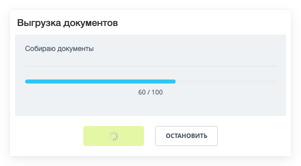
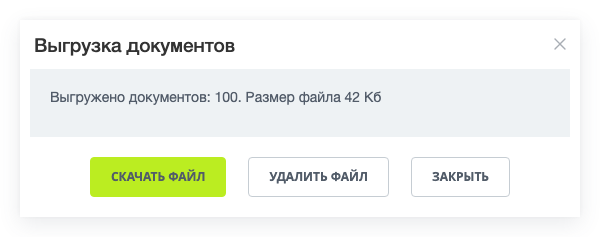
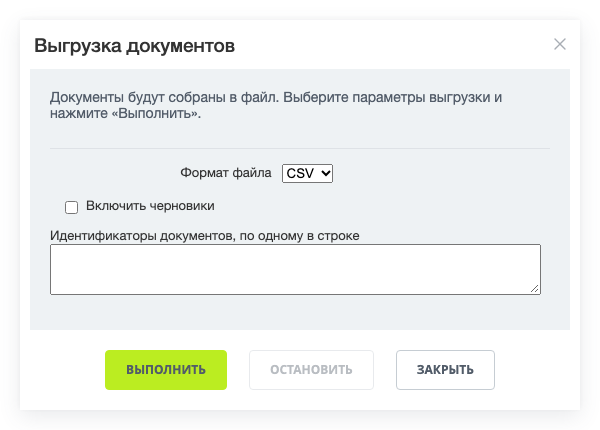
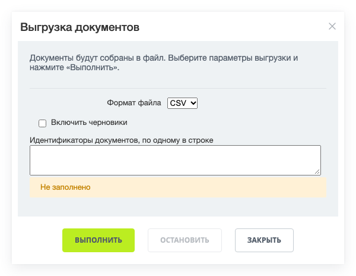
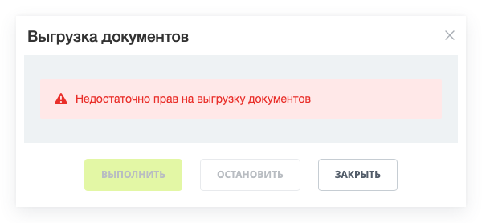
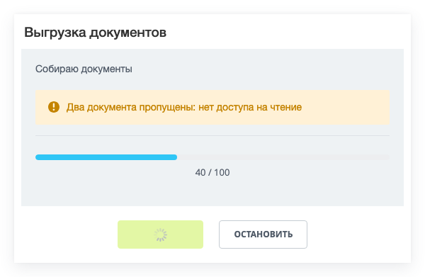

Пошаговое выполнение — диалог, который выполняет длительную серверную операцию серией коротких AJAX-запросов. Диалог показывает текст текущего шага, индикатор прогресса, кнопки запуска и остановки. За один запрос контроллер обрабатывает столько записей, сколько успевает до ограничения по времени, и сообщает расширению, сколько записей уже обработано.

Такой диалог ставят там, где операция не укладывается в один запрос: выгрузка списка в файл, загрузка данных из файла, массовое изменение записей, пересборка индекса.

Расширение отвечает только за диалог и цикл запросов. Оно не делит данные на порции и не хранит состояние операции между запросами: контроллер сам решает, где остановиться, сам сохраняет позицию и сам возвращает счетчики для индикатора.

Операцию ведет пользователь: она идет, пока открыт диалог, и прерывается, если пользователь закрыл страницу. Если операция должна доработать без него, берите итератор — он выполняется в фоне и описан в статье [Итератор](../advanced/stepper.md).

В Bitrix Framework за пошаговое выполнение отвечает расширение `ui.stepprocessing`. Оно экспортирует объекты:

-  `ProcessManager` — реестр процессов страницы. Создает процесс, находит его по идентификатору и удаляет.

-  `Process` — один процесс. Хранит очередь шагов, отправляет запросы и вызывает обработчики.

-  `Dialog` — окно процесса: заголовок, текст, индикатор прогресса, поля параметров и кнопки.

-  `ProcessState` — состояния процесса.

-  `ProcessResultStatus` — значения поля `STATUS` в ответе контроллера.

-  `ProcessCallback` — имена обработчиков процесса и шага.

-  `ProcessEvent` и `DialogEvent` — имена событий.

## Подключить расширение

Если вы подключаете диалог из PHP, загрузите расширение `ui.stepprocessing`.

```php
\Bitrix\Main\UI\Extension::load('ui.stepprocessing');
```

Вместе с расширением подключаются его зависимости: `main.core`, `main.core.events`, `main.popup`, `ui.alerts`, `ui.buttons`, `ui.design-tokens` и `ui.progressbar`. Загружать их отдельно не нужно.

Если вы работаете в модульном JavaScript, импортируйте нужные объекты из `ui.stepprocessing`.

```js
import { ProcessManager, ProcessCallback, ProcessState } from 'ui.stepprocessing';
```

Вне модульного JavaScript те же объекты доступны в пространстве имен `BX.UI.StepProcessing`.

## Как идет пошаговое выполнение

Процесс состоит из очереди шагов. Один шаг — это одно действие контроллера, которое расширение вызывает столько раз, сколько нужно, чтобы обработать все записи.

Порядок работы такой:

1. Пользователь открывает диалог методом `showDialog()` и нажимает кнопку запуска.

2. Расширение создает токен процесса и отправляет первый запрос к действию первого шага очереди.

3. Контроллер обрабатывает порцию данных и возвращает поле `STATUS` со значением `PROGRESS`, число обработанных записей и их общее число.

4. Расширение обновляет индикатор прогресса и через 100 миллисекунд повторяет запрос к тому же действию.

5. Контроллер возвращает поле `STATUS` со значением `COMPLETED`, и расширение переходит к следующему шагу очереди. После последнего шага процесс завершается.

В каждом запросе расширение передает параметр `PROCESS_TOKEN` — строку, которая не меняется до конца процесса. По нему контроллер отличает первый запрос от продолжения: при первом он готовит состояние, при повторных восстанавливает сохраненное. Новый токен расширение создает при каждом нажатии кнопки запуска, поэтому повторный запуск начинает операцию заново.

Запросы идут последовательно: следующий запрос расширение отправляет только после ответа на предыдущий. Пока процесс работает, диалог показывает текст текущего шага и счетчик обработанных записей, кнопка запуска ждет ответа, а кнопка закрытия и крестик в шапке окна скрыты.

{width=600px height=332px}

## Создать процесс

Процессы страницы создает и хранит `ProcessManager`.

#|
|| **Метод** | **Описание** ||
|| `create(options)` | Создает процесс по параметрам и запоминает его под идентификатором из поля `id`. Возвращает объект `Process` ||
|| `get(id)` | Возвращает процесс по идентификатору. Возвращает `null`, если процесса с таким идентификатором нет ||
|| `has(id)` | Возвращает `true`, если процесс с таким идентификатором создан ||
|| `delete(id)` | Закрывает диалог процесса, прерывает текущий запрос и убирает процесс из реестра ||
|#

Процесс создают один раз при загрузке страницы, а диалог открывают по действию пользователя — нажатием кнопки или пункта меню.

**Пример.** Страница создает процесс выгрузки документов и открывает его диалог по нажатию кнопки.

```js
import { ProcessManager } from 'ui.stepprocessing';

ProcessManager.create({
    id: 'documentExport',
    controller: 'my:content.DocumentExport',
    messages: {
        DialogTitle: 'Выгрузка документов',
        DialogSummary: 'Документы будут собраны в файл.',
    },
    params: {
        format: 'csv',
    },
    queue: [
        {
            action: 'export',
            title: 'Собираю документы',
        },
    ],
});

document.getElementById('document-export-button').addEventListener('click', () => {
    ProcessManager.get('documentExport').showDialog();
});
```

Тот же объект можно создать напрямую через конструктор `new Process(options)`. Это нужно, когда процессом владеет ваш класс и реестр процессов страницы не требуется.

Созданным процессом управляют его методы.

#|
|| **Метод** | **Описание** ||
|| `showDialog()` | Показывает окно процесса. Если запрос не идет, переводит процесс в состояние `INTERMEDIATE` ||
|| `closeDialog()` | Закрывает окно. Если запрос идет, сначала останавливает процесс ||
|| `start(step)` | Запускает процесс. Необязательный аргумент — номер шага очереди, с которого начать, нумерация с единицы. Работает в состояниях `INTERMEDIATE`, `STOPPED` и `COMPLETED` ||
|| `stop()` | Останавливает процесс. Работает в состоянии `RUNNING` ||
|| `getState()` | Возвращает текущее состояние процесса ||
|| `getId()` | Возвращает идентификатор процесса ||
|| `setParam(name, value)` | Задает одно поле запроса. Значение уходит в следующем и всех дальнейших запросах ||
|| `getParam(name)` | Возвращает значение поля запроса. Возвращает `null`, если поле не задано или его значение пустое ||
|| `setParams(params)` | Заменяет весь набор полей запроса набором из объекта. Прежние поля пропадают ||
|| `addQueueAction(step)` | Добавляет шаг в конец очереди ||
|| `setQueue(steps)` | Добавляет в конец очереди все шаги из массива. Прежние шаги не удаляет, несмотря на имя ||
|| `setHandler(type, handler)` | Задает обработчик процесса ||
|| `setHandlers(handlers)` | Задает несколько обработчиков объектом, где ключ — имя обработчика ||
|| `setMessage(id, text)` | Меняет одну подпись диалога ||
|| `setMessages(messages)` | Меняет несколько подписей объектом, где ключ — имя подписи ||
|| `getDialog()` | Возвращает диалог процесса ||
|| `callAction(name)` | Отправляет одиночный запрос к действию с этим именем ||
|#

Каждый из этих методов возвращает сам процесс, поэтому настройку собирают цепочкой.

Подписи расширение копирует в диалог, когда создает его, поэтому методы `setMessage()` и `setMessages()` меняют окно только до первого вызова `showDialog()`. После этого подписи задают заново созданным процессом.

Кнопки запуска и остановки вызывают методы `start()` и `stop()`. Тот же запуск можно сделать из кода — например, стартовать процесс сразу при открытии диалога или продолжить операцию не с первого шага очереди.

**Пример.** Кнопка формы открывает диалог и сразу запускает процесс со значениями полей этой формы.

```js
ProcessManager.get('documentExport')
    .setParams(BX.ajax.prepareForm(document.getElementById('document-filter')).data)
    .showDialog()
    .start();
```

Метод `BX.ajax.prepareForm()` собирает значения формы и возвращает объект, у которого поле `data` — готовый набор полей запроса. Вызывайте `setParams()` до метода `start()`: он заменяет весь набор параметров, а токен процесса расширение кладет в них уже при запуске.



Задайте процессу конечную точку запроса: параметр `controller` или параметр `component`. Без них конструктор прерывает создание процесса ошибкой `TypeError`.



## Задать параметры процесса

Первый и единственный аргумент метода `create()` — параметры процесса.

#|
|| **Параметр** | **Тип** | **Описание** ||
|| `id` | `string` | Задает идентификатор процесса. По нему процесс находят методом `get()`. Если параметр не задан, расширение создает случайный идентификатор, и найти процесс в реестре будет нельзя ||
|| `controller` | `string` | Задает контроллер, к действиям которого идут запросы шагов. Имя пишут как в методе `BX.ajax.runAction()`, без имени действия ||
|| `component` | `string` | Задает компонент, к действиям которого идут запросы шагов. Расширение учитывает параметр, только если параметр `controller` не задан ||
|| `componentMode` | `string` | Задает режим вызова действия компонента: `class` — действие класса компонента, `ajax` — действие из файла `ajax.php`. По умолчанию `class` ||
|| `params` | `Object` | Задает поля, которые уходят в каждый запрос процесса. Вложенные объекты и массивы расширение раскладывает в поля вида `имя[ключ]` ||
|| `queue` | `Array` | Задает очередь шагов процесса ||
|| `optionsFields` | `Object` \| `Array` | Задает поля, которые пользователь заполняет в диалоге до запуска ||
|| `messages` | `Object` | Задает подписи диалога и служебные тексты процесса ||
|| `handlers` | `Object` | Задает обработчики процесса ||
|| `showButtons` | `Object` | Задает, какие кнопки создать в диалоге: `start`, `stop`, `close`. По умолчанию создаются все три ||
|| `dialogMinWidth` | `number` | Задает минимальную ширину окна в пикселях. По умолчанию `500` ||
|| `dialogMaxWidth` | `number` | Задает максимальную ширину окна в пикселях. По умолчанию `1000` ||
|| `popupOptions` | `Object` | Задает параметры всплывающего окна. Расширение накладывает их поверх своих настроек окна ||
|#

Кнопку, отключенную параметром `showButtons`, расширение не создает вовсе. Кнопка остановки при этом не появится даже во время работы процесса, поэтому оставляйте ее для операций, которые пользователю может понадобиться прервать.

Окно процесса расширение создает перетаскиваемым и изменяемым по размеру, с затемнением фона. Закрыть его щелчком мимо окна или клавишей Esc нельзя. Эти настройки меняет параметр `popupOptions` — расширение передает его в [main.popup](./main-popup.md).

**Пример.** Окно процесса нельзя перетащить и изменить по размеру, а страница за ним не прокручивается.

```js
ProcessManager.create({
    id: 'documentExport',
    controller: 'my:content.DocumentExport',
    dialogMaxWidth: 600,
    popupOptions: {
        resizable: false,
        draggable: false,
        disableScroll: true,
    },
    queue: [{ action: 'export' }],
});
```



Расширение объявляет параметр `method` со значениями `GET` и `POST`, но не применяет его: и запросы шагов, и запросы отмены и завершения всегда уходят методом `POST`. То же относится к полю `method` в шаге очереди. Рассчитывайте серверную часть на `POST`.



## Описать очередь шагов

Параметр `queue` — массив шагов. Каждый элемент описывает одно действие контроллера.

#|
|| **Поле** | **Тип** | **Описание** ||
|| `action` | `string` | Задает имя действия контроллера или компонента. Без него расширение прерывает процесс ошибкой ||
|| `title` | `string` | Задает текст, который диалог показывает при переходе на шаг. Если поле не задано, для первого шага диалог показывает текст сообщения `WaitingResponse`, а для следующих шагов очищает текст ||
|| `progressBarTitle` | `string` | Задает подпись перед счетчиком индикатора прогресса. На экран подпись не попадает ||
|| `controller` | `string` | Задает контроллер этого шага вместо основного. Работает, только когда процесс создан с параметром `controller` ||
|| `params` | `Object` | Задает дополнительные поля запроса для этого шага. Они добавляются к полям из параметра `params` процесса ||
|| `finalize` | `boolean` | Помечает шаг завершающим. Расширение учитывает наличие поля, а не его значение ||
|| `handlers` | `Object` | Задает обработчики, которые работают только на этом шаге ||
|#

Шаги идут в том порядке, в котором они перечислены в массиве. Расширение переходит к следующему шагу, когда контроллер вернул поле `STATUS` со значением `COMPLETED`.



Подпись из поля `progressBarTitle` пользователь не увидит. Расширение задает ее индикатору прогресса уже после того, как индикатор собран, и в разметку она не попадает: под полосой остается только счетчик вида `60 / 100`. Поясняющую строку возвращайте ключом `SUMMARY` в ответе действия — ее диалог показывает над индикатором.



Добавить шаг к созданному процессу можно методом `addQueueAction(step)`. Он принимает такой же объект и дописывает шаг в конец очереди.

**Пример.** Процесс сначала считает общее число документов, затем выгружает их.

```js
ProcessManager.create({
    id: 'documentExport',
    controller: 'my:content.DocumentExport',
    queue: [
        {
            action: 'countDocuments',
            title: 'Считаю документы',
        },
        {
            action: 'export',
            title: 'Собираю документы',
            progressBarTitle: 'Обработано документов:',
        },
    ],
});
```



Очередь обязательна: без параметра `queue` хотя бы с одним шагом расширение прерывает первый же запрос ошибкой. Для процесса из одного действия задавайте очередь из одного шага.



## Написать серверную часть

Шаг вызывает обычное действие контроллера Bitrix Framework — отдельного базового класса для пошагового выполнения расширение не требует. Класс наследуют от `\Bitrix\Main\Engine\Controller`, а имя для параметра `controller` берут то же, что и для метода `BX.ajax.runAction()`: в примерах статьи класс `DocumentExport` модуля `my.content` вызывается как `my:content.DocumentExport`. Как связать пространство имен модуля с этим идентификатором, описано в статье [Контроллеры](../framework/controllers.md).

Действие шага возвращает массив, из которого расширение читает состояние операции.

#|
|| **Ключ ответа** | **Описание** ||
|| `STATUS` | Состояние шага: `PROGRESS` — шаг не закончен, расширение повторит запрос к тому же действию, `COMPLETED` — шаг закончен, расширение переходит к следующему. Любое другое значение расширение считает ошибкой и показывает текст сообщения `RequestError` ||
|| `PROCESSED_ITEMS` | Число обработанных записей. Расширение подставляет его в индикатор прогресса ||
|| `TOTAL_ITEMS` | Общее число записей. При нуле или отсутствии индикатор прогресса скрыт ||
|| `SUMMARY` | Текст, который диалог показывает вместо текста шага ||
|| `SUMMARY_HTML` | Текст, который диалог показывает, если ключ `SUMMARY` пуст ||
|| `WARNING` | Текст предупреждения. Диалог показывает его отдельной желтой плашкой над индикатором прогресса ||
|| `FINALIZE` | Признак завершающего запроса. После завершения процесса расширение вызывает действие `finalize` ||
|| `NEXT_ACTION` | Имя действия для следующего запроса. Расширение учитывает ключ, только когда `STATUS` равен `PROGRESS` ||
|| `NEXT_CONTROLLER` | Имя контроллера для следующего запроса. Расширение учитывает ключ, только когда `STATUS` равен `PROGRESS`, а процесс создан с параметром `controller` ||
|| `DOWNLOAD_LINK` | Ссылка на готовый файл. Диалог заменяет кнопки на кнопки скачивания и удаления файла ||
|| `FILE_NAME` | Имя файла для атрибута `download` кнопки скачивания ||
|| `DOWNLOAD_LINK_NAME` | Подпись кнопки скачивания вместо значения по умолчанию ||
|| `CLEAR_LINK_NAME` | Подпись кнопки удаления файла вместо значения по умолчанию ||
|#



Текст из ключей `SUMMARY` и `SUMMARY_HTML` диалог вставляет в разметку как HTML и не экранирует. Не подставляйте в них данные, которые ввел пользователь, без экранирования на стороне контроллера.



Ключи `NEXT_ACTION` и `NEXT_CONTROLLER` нужны, когда следующий запрос должен уйти не туда, куда ушел предыдущий. Так контроллер переключает операцию между стадиями, не заводя отдельный шаг очереди: например, после сбора данных отправляет расширение к действию выгрузки.

Позицию операции контроллер хранит сам. Простой вариант — локальное хранилище сессии: оно переживает запросы одного пользователя и не требует таблицы в базе. Как его получить, описано в статье [Сессии](../framework/sessions.md).

**Пример.** Действие выгружает документы порциями и хранит позицию в локальном хранилище сессии.

```php
<?php

namespace My\Content\Infrastructure\Controller\Ajax;

use Bitrix\Main\Application;
use Bitrix\Main\Engine\Controller;
use Bitrix\Main\Error;
use My\Content\DocumentTable;

final class DocumentExport extends Controller
{
    private const STORAGE_CATEGORY = 'my.content.document.export';
    private const PORTION = 100;

    public function exportAction(): ?array
    {
        $token = (string)$this->getRequest()->get('PROCESS_TOKEN');
        if ($token === '')
        {
            $this->addError(new Error('Не передан токен процесса', 'PROCESS_TOKEN_MISSING'));

            return null;
        }

        $storage = Application::getInstance()->getLocalSession(self::STORAGE_CATEGORY);
        $state = $storage->get('state');

        if (!is_array($state) || ($state['token'] ?? '') !== $token)
        {
            $state = [
                'token' => $token,
                'lastId' => 0,
                'processed' => 0,
                'total' => DocumentTable::getCount(),
            ];
        }

        $documents =
            DocumentTable::query()
                ->setSelect(['ID', 'TITLE'])
                ->where('ID', '>', $state['lastId'])
                ->setOrder(['ID' => 'ASC'])
                ->setLimit(self::PORTION)
                ->fetchAll()
        ;

        foreach ($documents as $document)
        {
            $state['lastId'] = (int)$document['ID'];
            $state['processed']++;
        }

        $storage->set('state', $state);

        return [
            'STATUS' => count($documents) < self::PORTION ? 'COMPLETED' : 'PROGRESS',
            'PROCESSED_ITEMS' => $state['processed'],
            'TOTAL_ITEMS' => $state['total'],
        ];
    }
}
```

Размер порции подбирают так, чтобы один запрос укладывался в ограничение времени выполнения PHP с запасом. В платформе для такой операции берут от ста до пятисот записей за запрос.

Позицию можно не хранить на сервере, а возвращать расширению и получать обратно следующим запросом. Для этого добавьте свои ключи в ответ действия и перенесите их в параметры процесса обработчиком `StepCompleted`.

**Пример.** Обработчик берет идентификатор последней обработанной записи из своего ключа ответа `LAST_ID` и кладет его в параметры следующего запроса.

```js
import { ProcessManager, ProcessResultStatus } from 'ui.stepprocessing';

ProcessManager.create({
    id: 'documentExport',
    controller: 'my:content.DocumentExport',
    queue: [
        {
            action: 'export',
            title: 'Собираю документы',
            handlers: {
                StepCompleted(status, result) {
                    if (status === ProcessResultStatus.progress) {
                        this.setParam('lastId', result.LAST_ID);
                    }
                },
            },
        },
    ],
});
```

Обработчик получает объект процесса в `this`, поэтому методы `setParam()` и `getParam()` доступны прямо в нем.

### Остановить процесс

Кнопка остановки не обрывает операцию на стороне браузера молча: расширение прерывает текущий запрос и отправляет к контроллеру процесса запрос к действию `cancel`. В него уходят параметры процесса и дополнительное поле `cancelingAction` с именем действия, которое выполнялось в момент остановки.

Действие `cancel` удаляет сохраненное состояние операции и временные файлы. Ответ с полем `STATUS` со значением `COMPLETED` завершает процесс, и диалог показывает текст сообщения `RequestCanceled`.

**Пример.** Действие отмены в том же контроллере очищает сохраненную позицию операции.

```php
public function cancelAction(): array
{
    Application::getInstance()
        ->getLocalSession(self::STORAGE_CATEGORY)
        ->offsetUnset('state')
    ;

    return ['STATUS' => 'COMPLETED'];
}
```



Расширение всегда обращается к действию с именем `cancel` у контроллера, заданного параметром `controller` процесса. Имя действия и контроллер не настраиваются: контроллер шага, заданный полем `controller` очереди, на запрос отмены не влияет.



### Завершить процесс

Завершающий запрос нужен, когда после последнего шага остается работа, которую не видит пользователь: удалить временный файл, снять блокировку, очистить сохраненное состояние.

Расширение отправляет его к действию `finalize` контроллера процесса. Запрос уходит в двух случаях: контроллер вернул ключ `FINALIZE`, либо последний элемент очереди помечен полем `finalize`. В запрос попадают только параметры процесса и токен — значения полей, которые пользователь заполнил перед запуском, в нем не приходят. То же относится к запросу отмены.

**Пример.** Последний шаг очереди помечен завершающим.

```js
ProcessManager.create({
    id: 'documentExport',
    controller: 'my:content.DocumentExport',
    queue: [
        {
            action: 'export',
            title: 'Собираю документы',
        },
        {
            action: 'finalize',
            finalize: true,
        },
    ],
});
```

Шаг с полем `finalize` расширение не выполняет как обычный шаг очереди: оно завершает процесс и отправляет отдельный запрос к действию `finalize`. Имя действия в таком шаге на адрес запроса не влияет, поэтому указывайте в нем то же имя — так шаг читается однозначно.



Поле `finalize` расширение проверяет на наличие, а не на значение. Шаг с полем `finalize` со значением `false` расширение тоже считает завершающим. Чтобы отключить завершающий запрос, уберите поле целиком.



### Отдать готовый файл

Когда операция собирает файл, последний ответ возвращает ссылку на него в ключе `DOWNLOAD_LINK`. Диалог заменяет свои кнопки на три: скачивание файла, удаление файла и закрытие окна.

Кнопка скачивания — ссылка с атрибутом `download`, в который расширение подставляет значение ключа `FILE_NAME`. Кнопка удаления вызывает действие `clear` у контроллера последнего шага, а через секунду оставляет в диалоге только кнопку закрытия.

{width=600px height=237px}

**Пример.** Последний ответ действия отдает ссылку на собранный файл.

```php
return [
    'STATUS' => 'COMPLETED',
    'PROCESSED_ITEMS' => $state['processed'],
    'TOTAL_ITEMS' => $state['total'],
    'SUMMARY' => 'Файл готов',
    'FILE_NAME' => 'documents.csv',
    'DOWNLOAD_LINK' => $downloadLink,
];
```

Ссылку обычно ведут на отдельное действие того же контроллера, которое отдает файл ответом `\Bitrix\Main\Engine\Response\File`. Подписи кнопок задают ключами `DOWNLOAD_LINK_NAME` и `CLEAR_LINK_NAME` в ответе или сообщениями `DialogExportDownloadButton` и `DialogExportClearButton` в параметрах процесса.

## Спросить параметры до запуска

Параметр `optionsFields` добавляет в диалог поля, которые пользователь заполняет перед нажатием кнопки запуска. Заполненные значения расширение добавляет в каждый запрос шага под именем поля.

Поля задают объектом, где ключ — имя поля, либо массивом описаний. Расширение принимает оба формата и пропускает описания без полей `name` и `type`.



Набор полей диалога расширение берет только из параметра `optionsFields`. Методы `setOptionsFields()` и `addOptionsField()` у созданного процесса новых полей в диалоге не создают: они наполняют внутренний список, по которому расширение решает, чьи значения сохранить в `sessionStorage`. Чтобы изменить набор полей, создайте процесс заново.



#|
|| **Поле описания** | **Описание** ||
|| `name` | Задает имя поля в запросе. Обязательное поле ||
|| `type` | Задает тип поля: `checkbox`, `select`, `radio`, `text` или `file`. Обязательное поле ||
|| `title` | Задает подпись поля в диалоге ||
|| `value` | Задает начальное значение поля ||
|| `obligatory` | Требует заполнить поле перед запуском. По умолчанию `false` ||
|| `emptyMessage` | Задает текст предупреждения о незаполненном поле. По умолчанию «Не заполнено», для типа `file` — «Обязательно укажите файл для загрузки» ||
|| `list` | Задает варианты для типов `select` и `radio`: ключ — значение поля, значение — подпись варианта ||
|| `multiple` | Разрешает выбрать несколько вариантов в поле типа `select`. Принимает `true` или строку `Y`. По умолчанию `false` ||
|| `size` | Задает число видимых строк списка `select`. Расширение учитывает поле только вместе с `multiple` ||
|| `textSize` | Задает число столбцов поля типа `text`. По умолчанию `50` ||
|| `textLine` | Задает число строк поля типа `text`. По умолчанию `10` ||
|#

Значения полей приходят в запрос по-разному в зависимости от типа:

-  `checkbox` — строка `Y` или `N`. Этими же строками задают начальное состояние флажка в поле `value`.

-  `select` с полем `multiple` — массив выбранных значений в поле вида `имя[]`, без него — одно значение.

-  `radio` — значение выбранного варианта.

-  `text` — содержимое многострочного поля ввода.

-  `file` — файл, который уходит в теле запроса и читается как обычный загруженный файл.

Идентификатор поля в разметке расширение задает само по имени процесса и имени поля, поэтому передавать его не нужно.

**Пример.** Перед выгрузкой пользователь выбирает формат файла, решает, включать ли черновики, и может ограничить выгрузку списком документов.

```js
ProcessManager.create({
    id: 'documentExport',
    controller: 'my:content.DocumentExport',
    optionsFields: {
        format: {
            name: 'format',
            type: 'select',
            title: 'Формат файла',
            list: {
                csv: 'CSV',
                excel: 'Excel',
            },
            value: 'csv',
        },
        withDrafts: {
            name: 'withDrafts',
            type: 'checkbox',
            title: 'Включить черновики',
            value: 'N',
        },
        documentList: {
            name: 'documentList',
            type: 'text',
            title: 'Идентификаторы документов, по одному в строке',
            textLine: 5,
        },
    },
    queue: [{ action: 'export' }],
});
```

Поля расширение выводит под вводным текстом в порядке их описания, а кнопка запуска остается на месте.

{width=600px height=430px}

Поле типа `checkbox` расширение всегда выводит одним флажком: поле `list` для него набор вариантов не задает. Выбор из нескольких значений задавайте типом `select` или `radio`.

Поле с признаком `obligatory` расширение проверяет при нажатии кнопки запуска. Незаполненное поле получает предупреждение из своего поля `emptyMessage`, и процесс не стартует. Для флажка проверка всегда проходит: снятый флажок расширение считает заполненным полем со значением `N`.

{width=600px height=464px}

Значения полей типов `checkbox`, `select` и `radio` расширение сохраняет в `sessionStorage` браузера и подставляет в диалог при следующем открытии. Содержимое поля типа `text` и выбранный файл не сохраняются.

Поля видны только до запуска: при нажатии кнопки запуска диалог убирает блок полей и показывает на их месте текст шага. Менять параметры по ходу процесса нельзя.

Значение поля можно задать из кода. Метод `getDialog()` возвращает диалог процесса, метод `getOptionField(name)` — поле по имени, метод `setValue(value)` — задает значение. Поля расширение создает вместе с окном, поэтому вызывайте `getOptionField()` после метода `showDialog()`.

**Пример.** Групповое действие списка подставляет отмеченные документы в поле и открывает диалог.

```js
const process = ProcessManager.get('documentExport');

process.showDialog();
process.getDialog().getOptionField('documentList').setValue(selectedIds.join('\n'));
```

## Следить за состоянием процесса

Расширение сообщает о ходе процесса двумя способами: обработчиками и событиями.

### Состояния процесса

Состояние процесса возвращает метод `getState()`, значения перечислены в объекте `ProcessState`.

#|
|| **Состояние** | **Значение** | **Когда наступает** ||
|| `intermediate` | `INTERMEDIATE` | Диалог открыт, процесс еще не запущен. Доступна кнопка запуска ||
|| `running` | `RUNNING` | Идет запрос шага. Доступна кнопка остановки, кнопка закрытия скрыта ||
|| `canceling` | `CANCELING` | Пользователь нажал кнопку остановки, расширение отправило запрос отмены ||
|| `stopped` | `STOPPED` | Операция остановлена: во время отмены пришел ответ со значением `PROGRESS`. Процесс можно запустить заново ||
|| `completed` | `COMPLETED` | Процесс закончен — последний шаг вернул `COMPLETED` или завершилась отмена ||
|| `error` | `ERROR` | Запрос вернул ошибку. Диалог показывает ее текст, индикатор прогресса краснеет ||
|#

В объекте `ProcessResultStatus` всего два значения: `progress` — строка `PROGRESS` и `completed` — строка `COMPLETED`. Ошибку контроллер сообщает не через это поле, а списком ошибок ответа.

Значение состояния `completed` совпадает со значением `ProcessResultStatus.completed`, но объекты разные: `ProcessState` описывает состояние процесса, `ProcessResultStatus` — значение поля `STATUS` в ответе контроллера. В обработчике `StateChanged` сравнивайте с `ProcessState`, в обработчике `StepCompleted` — с `ProcessResultStatus`.

### Обработчики

Имена обработчиков перечислены в объекте `ProcessCallback`. Их задают параметром `handlers` при создании процесса или методом `setHandler(type, handler)` у созданного процесса.

#|
|| **Обработчик** | **Когда вызывается и что получает** ||
|| `StateChanged` | При каждой смене состояния. Аргументы: новое состояние из `ProcessState` и результат последнего ответа ||
|| `StepCompleted` | После каждого успешного ответа контроллера. Аргументы: значение поля `STATUS` из ответа и весь ответ. Работает только в обработчиках шага очереди ||
|| `RequestStart` | Перед отправкой запроса шага. Аргумент: объект `FormData` запроса, в который можно дописать свои поля ||
|| `RequestStop` | Вместо запроса отмены. Аргумент: копия параметров процесса ||
|| `RequestFinalize` | Вместо запроса завершения. Аргумент: копия параметров процесса ||
|#

Внутри обработчика `this` — объект `Process`. Через него доступны методы `setParam()`, `getParam()`, `getDialog()`, `closeDialog()` и `callAction()`.

Обработчик, заданный в поле `handlers` шага очереди, перекрывает обработчик процесса с тем же именем: пока идет этот шаг, расширение вызывает только обработчик шага.

**Пример.** После успешного завершения процесс закрывает свой диалог.

```js
import { ProcessManager, ProcessCallback, ProcessState } from 'ui.stepprocessing';

ProcessManager.create({
    id: 'documentExport',
    controller: 'my:content.DocumentExport',
    queue: [{ action: 'export' }],
}).setHandler(ProcessCallback.StateChanged, function(state) {
    if (state === ProcessState.completed) {
        this.closeDialog();
    }
});
```

Отдельно задают обработчики показа и закрытия окна: `dialogShown` и `dialogClosed`. Их передают в параметре `handlers` вместе с остальными, но задать их нужно до первого открытия диалога — расширение читает их в момент создания окна.



Обработчики `RequestStop` и `RequestFinalize` заменяют штатный запрос, а не дополняют его. Если вы задали `RequestStop`, расширение не вызовет действие `cancel`, а если задали `RequestFinalize` — действие `finalize`. Очистку состояния на сервере в этом случае вызывайте из обработчика сами.



### События

Кроме обработчиков расширение отправляет события через `EventEmitter` из `main.core.events`. События видны всей странице, поэтому по ним удобно связывать процесс с кодом, который о нем не знает.

#|
|| **Событие** | **Константа** | **Данные** ||
|| `BX.UI.StepProcessing.StateChanged` | `ProcessEvent.StateChanged` | Поле `state` с новым состоянием и поле `result` с последним ответом контроллера ||
|| `BX.UI.StepProcessing.BeforeRequest` | `ProcessEvent.BeforeRequest` | Поле `process` с объектом процесса и поле `actionData` с данными запроса. У запроса шага это объект `FormData`, у запросов отмены и завершения — обычный объект ||
|| `BX.UI.StepProcessing.Dialog.Shown` | `DialogEvent.Shown` | Без данных ||
|| `BX.UI.StepProcessing.Dialog.Closed` | `DialogEvent.Closed` | Без данных ||
|| `BX.UI.StepProcessing.Dialog.Start` | `DialogEvent.Start` | Без данных ||
|| `BX.UI.StepProcessing.Dialog.Stop` | `DialogEvent.Stop` | Без данных ||
|#

Событие `BeforeRequest` расширение отправляет перед запросом шага, перед запросом отмены и перед запросом завершения. Если на странице несколько процессов, различайте их по полю `process`.

**Пример.** Обработчик события дописывает адрес страницы в запросы шагов процесса.

```js
import { EventEmitter } from 'main.core.events';
import { ProcessEvent } from 'ui.stepprocessing';

EventEmitter.subscribe(ProcessEvent.BeforeRequest, (event) => {
    const { process, actionData } = event.getData();

    if (process.getId() !== 'documentExport') {
        return;
    }

    if (actionData instanceof FormData) {
        actionData.append('sourcePage', location.pathname);
    } else {
        actionData.sourcePage = location.pathname;
    }
});
```

Проверка типа нужна потому, что расширение собирает запрос шага объектом `FormData`, а запросы отмены и завершения — обычным объектом. Без проверки обработчик упадет на первой же отмене.

События диалога расширение отправляет без данных: обработчик узнает только сам факт события. Если нужен объект диалога, используйте обработчики `dialogShown` и `dialogClosed`.

## Показать ошибки

Неудачный ответ контроллера расширение показывает само. Красная плашка появляется над индикатором прогресса, процесс переходит в состояние `ERROR`, кнопка закрытия становится доступной.

Чтобы вернуть ошибку, добавьте ее в контроллере методом `addError()` и верните `null` из действия.

**Пример.** Действие прерывает выгрузку, если у пользователя нет прав администратора.

```php
if (!$this->getCurrentUser()->isAdmin())
{
    $this->addError(new Error('Недостаточно прав на выгрузку', 'ACCESS_DENIED'));

    return null;
}
```

{width=600px height=278px}

Если ошибок несколько, диалог показывает последние десять. Текст ошибок расширение вставляет в разметку как HTML, поэтому не подставляйте в сообщение неэкранированные данные пользователя.

Расширение само обрабатывает две ситуации:

-  Сессия истекла. Ответ с кодом `401` расширение показывает текстом сообщения `AuthError`. Повторять запрос оно не пытается.

-  Обрыв связи. Ошибку с кодом `NETWORK_ERROR` расширение повторяет: делает еще две попытки с паузой в пятнадцать секунд и только затем показывает текст сообщения `RequestError`. Счетчик попыток обнуляется при каждом успешном ответе.

Предупреждение, которое не прерывает операцию, возвращайте ключом `WARNING`. Диалог показывает его желтой плашкой между текстом шага и индикатором прогресса и продолжает выполнение шагов.

{width=600px height=391px}

## Изменить подписи диалога

Параметр `messages` задает тексты диалога и служебные сообщения процесса. Переданные ключи расширение накладывает поверх значений по умолчанию, поэтому задавать можно только часть подписей.

#|
|| **Ключ** | **Значение по умолчанию** | **Где видит пользователь** ||
|| `DialogTitle` | Значения нет | Заголовок окна ||
|| `DialogSummary` | Значения нет | Текст в окне до запуска процесса ||
|| `DialogStartButton` | Выполнить | Кнопка запуска ||
|| `DialogStopButton` | Остановить | Кнопка остановки ||
|| `DialogCloseButton` | Закрыть | Кнопка закрытия окна ||
|| `WaitingResponse` | Пожалуйста, подождите... | Текст шага, у которого не задано поле `title` ||
|| `RequestCanceling` | Отменяю... | Текст в окне, пока идет запрос отмены ||
|| `RequestCanceled` | Отменено | Текст в окне после завершения отмены ||
|| `RequestCompleted` | Выполнено | Текст в окне после завершения процесса, если последний ответ не вернул ключ `SUMMARY` ||
|| `RequestError` | При выполнении запроса произошла ошибка | Текст ошибки, когда контроллер не вернул своей ||
|| `AuthError` | Ваша сессия истекла, повторите попытку авторизации | Текст ошибки при ответе с кодом `401` ||
|| `DialogExportDownloadButton` | Скачать файл | Кнопка скачивания готового файла ||
|| `DialogExportClearButton` | Удалить файл | Кнопка удаления готового файла ||
|#

Ключи `DialogTitle` и `DialogSummary` значения по умолчанию не имеют: без них окно открывается без заголовка и без вводного текста. Задавайте оба.

**Пример.** Процесс получает свои подписи вместо значений по умолчанию.

```php
<?php

use Bitrix\Main\Localization\Loc;
use Bitrix\Main\Web\Json;

?>
<script>
    BX.UI.StepProcessing.ProcessManager.create(<?= Json::encode([
        'id' => 'documentExport',
        'controller' => 'my:content.DocumentExport',
        'messages' => [
            'DialogTitle' => Loc::getMessage('MY_CONTENT_EXPORT_TITLE'),
            'DialogSummary' => Loc::getMessage('MY_CONTENT_EXPORT_SUMMARY'),
            'RequestCompleted' => Loc::getMessage('MY_CONTENT_EXPORT_COMPLETED'),
        ],
        'queue' => [
            [
                'action' => 'export',
                'title' => Loc::getMessage('MY_CONTENT_EXPORT_STEP'),
            ],
        ],
    ]) ?>);
</script>
```

Так процесс собирают из PHP: параметры готовят массивом, переводят в JSON и передают в метод `create()`. Тексты берут из языковых файлов, поэтому диалог переводится вместе с остальным интерфейсом.

## Вызвать действие компонента

Вместо контроллера конечной точкой запроса может быть компонент. Тогда вместо параметра `controller` задают параметр `component` с именем компонента и параметр `componentMode` с режимом вызова.

-  `class` — расширение вызывает действие класса компонента. Значение по умолчанию.

-  `ajax` — расширение вызывает действие из файла `ajax.php` компонента.

**Пример.** Процесс вызывает действие компонента в режиме `ajax`.

```js
ProcessManager.create({
    id: 'documentExport',
    component: 'my:content.document.list',
    componentMode: 'ajax',
    queue: [{ action: 'export' }],
});
```

Действия компонента возвращают такой же массив, что и действия контроллера. Отличается только адрес запроса: расширение отправляет его методом `BX.ajax.runComponentAction()`.

Если заданы оба параметра, расширение использует `controller`, а `component` не читает.

## Вызвать произвольное действие

Метод `callAction(name)` отправляет одиночный запрос к действию с этим именем, минуя очередь шагов. Расширение создает новый токен процесса, поэтому контроллер получит запрос как начало новой операции.

Метод нужен для действий, которые не входят в основную операцию: удалить собранный файл, снять блокировку, проверить готовность данных. Именно им расширение удаляет файл по кнопке в диалоге.

**Пример.** Код удаляет собранный файл вызовом действия `clear`.

```js
ProcessManager.get('documentExport').callAction('clear');
```

Ответ расширение разбирает по общим правилам: ключ `STATUS` со значением `PROGRESS` заставит его повторять запрос, пока действие не вернет `COMPLETED`.

## Связанные материалы

-  [Контроллеры](../framework/controllers.md) — серверная часть процесса и вызов действий через `BX.ajax.runAction()`.

-  [Сессии](../framework/sessions.md) — локальное хранилище сессии для состояния операции между запросами.

-  [Индикаторы прогресса ui.progressbar и ui.progressround](./ui-progress.md) — индикатор, который расширение показывает в диалоге.

-  [Всплывающие окна и меню main.popup](./main-popup.md) — окно диалога и его параметры.

-  [Кнопки ui.buttons](./ui-buttons.md) — кнопки диалога.

-  [Итератор](../advanced/stepper.md) — выполнение длительной операции в фоне, без открытого диалога.

-  [Агенты и фоновые задачи](../framework/background-jobs.md) — запуск кода по расписанию и в очереди.

-  [Расширения](../framework/extensions.md) — подключение JavaScript-расширений Bitrix Framework.
