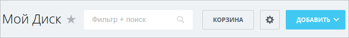

Панель инструментов — верхняя строка страницы. Она выводит заголовок, кнопки действий, [фильтр `main.ui.filter`](./main-ui-filter.md), звезду избранного и кнопку копирования ссылки.

Панелью управляет фасад `Bitrix\UI\Toolbar\Facade\Toolbar` из модуля `ui`, а разметку выводит компонент `bitrix:ui.toolbar`.

Используйте панель, когда странице нужны заголовок и действия в стандартном оформлении интерфейса Bitrix Framework. Кнопки для панели создают PHP-классы [`Bitrix\UI\Buttons`](./ui-buttons.md).

{width=690px height=76px}

## Как работает панель

Сначала код страницы наполняет панель через фасад, затем компонент выводит готовую разметку.

Все панели страницы хранит менеджер `Bitrix\UI\Toolbar\Manager`. Панель по умолчанию имеет идентификатор `default-toolbar` — его же возвращает константа `Toolbar::DEFAULT_ID`. Фасад передает статические вызовы этой панели и создает ее при первом обращении.

Компонент откладывает отрисовку до конца сборки страницы. Поэтому фасад можно вызывать в любом месте кода после подключения пролога: в файле страницы, в классе или шаблоне компонента, который подключен ниже панели. Порядок вызовов влияет только на порядок кнопок внутри одной группы.



Подключите модуль `ui` методом `Loader::includeModule('ui')` до первого вызова фасада, иначе автозагрузчик не найдет классы панели.



Страница задает заголовок и добавляет кнопку в правую группу.

```php
<?php

use Bitrix\Main\Loader;
use Bitrix\UI\Buttons\Button;
use Bitrix\UI\Buttons\Color;
use Bitrix\UI\Toolbar\Facade\Toolbar;

if (!Loader::includeModule('ui'))
{
    return;
}

Toolbar::setTitle('Заказы');

Toolbar::addButton(
    new Button([
        'text' => 'Создать заказ',
        'color' => Color::PRIMARY,
        'link' => '/orders/edit/0/',
    ])
);
```

Панель размещает элементы в фиксированном порядке слева направо: блок заголовка, кнопки после заголовка, фильтр вместе со своими кнопками, правые кнопки, произвольный HTML справа.

Настройки панели действуют в рамках одного запроса. Панель не хранит состояние между страницами, поэтому заголовок, кнопки и фильтр задавайте при каждой загрузке.

## Настроить заголовок

Без явных настроек панель показывает заголовок страницы — тот, что задает метод `$APPLICATION->setTitle()`.

Метод `setTitle()` фасада переопределяет заголовок только в панели. Заголовок вкладки браузера остается прежним.

Шаблон панели удаляет из заголовка HTML-теги, поэтому передавайте обычный текст.

#|
|| **Метод** | **Описание** ||
|| `setTitle(string $title)` | Задает заголовок панели ||
|| `getTitle($propertyName = false, $stripTags = false)` | Возвращает заголовок панели. Параметр `$propertyName` задает свойство страницы, из которого брать заголовок вместо заголовка документа. Параметр `$stripTags` со значением `true` удаляет HTML-теги из результата ||
|| `hideTitle()` | Скрывает блок заголовка со всеми его элементами ||
|| `hasTitle()` | Возвращает `true`, если блок заголовка выводится ||
|| `setTitleMinWidth(int $width)` | Задает минимальную ширину заголовка в пикселях. Принимает только положительное целое число, другие значения игнорирует ||
|| `getTitleMinWidth()` | Возвращает минимальную ширину заголовка или `null`, если она не задана ||
|| `setTitleMaxWidth(int $width)` | Задает максимальную ширину заголовка в пикселях. Принимает только положительное целое число, другие значения игнорирует ||
|| `getTitleMaxWidth()` | Возвращает максимальную ширину заголовка или `null`, если она не задана ||
|| `setTitleNoShrink(bool $flag = true)` | Запрещает сжимать блок заголовка, когда остальным элементам не хватает места ||
|| `isTitleNoShrink()` | Возвращает `true`, если блок заголовка запрещено сжимать ||
|| `enableMultiLineTitle()` | Разрешает переносить длинный заголовок на несколько строк ||
|| `disableMultiLineTitle()` | Выключает перенос: заголовок остается в одну строку ||
|| `isMultiLineTitleEnabled()` | Возвращает `true`, если перенос заголовка включен ||
|#

Панель получает заголовок с ограничением ширины и переносом на несколько строк.

```php
use Bitrix\UI\Toolbar\Facade\Toolbar;

Toolbar::setTitle('Заказы за квартал');
Toolbar::setTitleMinWidth(200);
Toolbar::setTitleMaxWidth(600);
Toolbar::enableMultiLineTitle();
```

### Разрешить редактирование заголовка

Метод `addEditableTitle()` добавляет к заголовку кнопку редактирования. По клику заголовок превращается в поле ввода с кнопками сохранения и отмены.

```php
use Bitrix\UI\Toolbar\Facade\Toolbar;

Toolbar::setTitle($report->getName());
Toolbar::addEditableTitle('Новый отчет');
```

Необязательный аргумент метода передает редактору заголовок по умолчанию.

Метод `getDefaultEditableTitle()` возвращает этот заголовок или `null`, если редактирование не включено.

Метод `hasEditableTitle()` возвращает `true`, когда редактирование заголовка включено.



Панель не сохраняет новый заголовок. Она только меняет текст на странице. Чтобы сохранить значение, подпишитесь в JavaScript на [событие `finishEditing`](#toolbar-events) и отправьте новый заголовок на сервер.



## Добавить кнопки

Метод `addButton()` принимает объект [`Bitrix\UI\Buttons\Button`](./ui-buttons.md) или массив его параметров. Вторым аргументом метод принимает место в панели.

```php
use Bitrix\UI\Buttons\Button;
use Bitrix\UI\Buttons\Color;
use Bitrix\UI\Buttons\JsCode;
use Bitrix\UI\Toolbar\ButtonLocation;
use Bitrix\UI\Toolbar\Facade\Toolbar;

// объект кнопки
Toolbar::addButton(
    new Button([
        'text' => 'Создать',
        'color' => Color::PRIMARY,
        'onclick' => new JsCode('openCreateSlider();'),
    ]),
    ButtonLocation::AFTER_TITLE
);

// массив параметров, панель сама создаст объект Button
Toolbar::addButton([
    'text' => 'Настройки',
    'color' => Color::LIGHT_BORDER,
    'link' => '/orders/settings/',
]);
```

Места кнопок задают константы класса `Bitrix\UI\Toolbar\ButtonLocation`.

#|
|| **Константа** | **Куда попадает кнопка** ||
|| `RIGHT` | В правую группу кнопок. Панель использует это место, если второй аргумент не передан ||
|| `AFTER_TITLE` | Сразу после заголовка, перед фильтром. Место для главного действия страницы, например для кнопки создания ||
|| `AFTER_FILTER` | В блок фильтра, справа от него. Кнопки этого места видны, только когда панель выводит фильтр ||
|| `AFTER_NAVIGATION` | В область собственной навигации панели. Компонент `bitrix:ui.toolbar` такую область не выводит и показывает кнопку в правой группе. Место рассчитано на панели с навигацией, например на панель CRM ||
|#



Константа `ButtonLocation::FILTER_RIGHT` устарела. Она продолжает работать как синоним `AFTER_FILTER`, но в новом коде используйте `AFTER_FILTER`.



### Задать иконку для свернутой кнопки

Панель сравнивает свою ширину с шириной содержимого. Если кнопки не помещаются, панель сворачивает их до иконок, начиная с самой правой, и разворачивает обратно, когда окно становится шире.

Свернуть можно только кнопку с иконкой. Для кнопки без иконки задайте иконку свернутого состояния ключом `toolbar-collapsed-icon` в наборе `dataset` — панель подставит ее вместо текста.

```php
use Bitrix\UI\Buttons\Button;
use Bitrix\UI\Buttons\Icon;
use Bitrix\UI\Toolbar\Facade\Toolbar;

Toolbar::addButton(
    new Button([
        'text' => 'Импорт',
        'link' => '/orders/import/',
        'dataset' => [
            'toolbar-collapsed-icon' => Icon::DOWNLOAD,
        ],
    ])
);
```

Кнопке с цветом `Color::PRIMARY` ключ задавать не нужно: в свернутом состоянии панель сама ставит ей иконку добавления.

### Изменить состав кнопок

Кнопки страницы часто добавляет чужой код: компонент списка, шаблон или обработчик события. Для таких случаев панель дает два метода.

Метод `deleteButtons()` принимает функцию-фильтр. Панель вызывает ее для каждой кнопки и передает саму кнопку и место, в котором она стоит. Если функция вернет `true`, панель удалит кнопку.

```php
use Bitrix\UI\Buttons\Button;
use Bitrix\UI\Toolbar\ButtonLocation;
use Bitrix\UI\Toolbar\Facade\Toolbar;

Toolbar::deleteButtons(
    static function (Button $button, string $location): bool
    {
        return $location === ButtonLocation::RIGHT && $button->getText() === 'Настройки';
    }
);
```

Метод `shuffleButtons()` меняет порядок кнопок. Он принимает функцию и место в панели. Функция получает массив кнопок этого места и должна вернуть новый массив, иначе метод выбросит `ArgumentTypeException`. Метод работает только для мест `RIGHT` и `AFTER_FILTER`.

```php
use Bitrix\UI\Toolbar\ButtonLocation;
use Bitrix\UI\Toolbar\Facade\Toolbar;

Toolbar::shuffleButtons(
    static fn(array $buttons): array => array_reverse($buttons),
    ButtonLocation::RIGHT
);
```

Метод `getButtons()` возвращает все кнопки панели одним массивом в том же порядке, в каком панель их выводит.

### Оформление кнопок в air-дизайне

Если в шаблоне сайта определена константа `AIR_SITE_TEMPLATE`, панель сама переводит добавленные кнопки в air-оформление: включает air-стиль, отключает верхний регистр текста и подбирает стиль по переданному цвету.

Правым кнопкам без явного размера панель ставит `Size::SMALL`. Кнопке после заголовка со стилем `AirButtonStyle::FILLED_SUCCESS` без иконки — иконку добавления.

Метод `hasAirDesign()` возвращает `true`, если air-дизайн включен. Проверяйте режим, когда оформление кнопки зависит от шаблона сайта.

## Добавить фильтр

Метод `addFilter()` подключает компонент `bitrix:main.ui.filter` с переданными параметрами и сохраняет его HTML в панели.

```php
use Bitrix\UI\Toolbar\Facade\Toolbar;

Toolbar::addFilter([
    'FILTER_ID' => 'orders_filter',
    'GRID_ID' => 'orders_grid',
    'FILTER' => [
        ['id' => 'FIND', 'name' => 'Поиск'],
        ['id' => 'STATUS', 'name' => 'Статус', 'type' => 'list'],
    ],
    'ENABLE_LABEL' => true,
]);
```

Поля фильтра, пресеты и чтение выбранных значений описывает статья про [фильтр `main.ui.filter`](./main-ui-filter.md).

Панель выводит только один фильтр. Повторный вызов `addFilter()` заменяет предыдущую разметку.

В air-дизайне панель подключает фильтр с темой `Theme::AIR` и отключает автофокус в его настройках.

Метод `setFilter()` принимает готовый HTML фильтра. Используйте его, если фильтр уже отрисовал другой код.

Метод `getFilter()` возвращает текущую разметку фильтра или `null`, если фильтра в панели нет.

```php
use Bitrix\UI\Toolbar\Facade\Toolbar;

Toolbar::setFilter($filterHtml);
```

Чтобы поставить кнопку рядом с фильтром, передайте место `ButtonLocation::AFTER_FILTER`.

## Добавить свой HTML

Панель размещает готовую разметку в пяти местах вокруг заголовка и справа. Используйте их для счетчиков, переключателей режимов, подзаголовков и других элементов, которые не укладываются в кнопку.

#|
|| **Метод** | **Куда попадает разметка** | **Парный метод чтения** ||
|| `addBeforeTitleBoxHtml(string $html)` | В начале блока заголовка, перед всей строкой заголовка | `getBeforeTitleBoxHtml()` ||
|| `addBeforeTitleHtml(string $html)` | В строке заголовка, непосредственно перед его текстом | `getBeforeTitleHtml()` ||
|| `addAfterTitleHtml(string $html)` | Внутри блока заголовка, после текста и кнопок заголовка | `getAfterTitleHtml()` ||
|| `addUnderTitleHtml(string $html)` | Под заголовком как подзаголовок | `getUnderTitleHtml()` ||
|| `addRightCustomHtml(string $html, array $options = [])` | В правую часть панели, после правых кнопок. Опция `align` со значением `'right'` прижимает блок к правому краю, другие значения панель игнорирует | `getRightCustomHtml()` и `getRightCustomHtmlOptions()` ||
|#

Панель получает подзаголовок со временем обновления и счетчик у правого края.

```php
use Bitrix\UI\Toolbar\Facade\Toolbar;

Toolbar::addUnderTitleHtml('<span class="orders-subtitle">Обновлено ' . htmlspecialcharsbx($updateTime) . '</span>');
Toolbar::addRightCustomHtml($counterHtml, ['align' => 'right']);
```

Панель выводит переданную строку как есть. Экранируйте пользовательские данные, чтобы не получить [XSS-уязвимость](../security/xss.md).

Каждый метод хранит одно значение: повторный вызов заменяет предыдущую разметку. Если в одном месте нужно несколько элементов, соберите их в одну строку.

Методы чтения возвращают `null`, если разметка не задана. Исключения — методы `getRightCustomHtml()` с пустой строкой и `getRightCustomHtmlOptions()` с пустым массивом.

## Настроить стандартные элементы

Кроме заголовка и кнопок панель выводит три собственных элемента: звезду избранного, кнопку копирования ссылки и кнопку фокус-режима.

Все три элемента находятся в блоке заголовка. Метод `hideTitle()` скрывает их вместе с заголовком.

### Звезда избранного

Звезда добавляет текущую страницу в левое меню Битрикс24. Панель показывает ее по умолчанию, но только когда заголовок не пустой.

Звездой управляют три метода:

-  `addFavoriteStar()` — включает звезду избранного.

-  `deleteFavoriteStar()` — убирает звезду со страницы.

-  `hasFavoriteStar()` — возвращает `true`, если звезда включена.

Адрес страницы и название пункта меню задают [параметры компонента](#component-params) или свойства страницы `FavoriteUrl` и `FavoriteTitleTemplate`.

### Кнопка копирования ссылки

Метод `setCopyLinkButton()` добавляет рядом с заголовком кнопку, которая копирует ссылку на страницу в буфер обмена и показывает всплывающее подтверждение.

```php
use Bitrix\UI\Toolbar\Facade\Toolbar;

Toolbar::setCopyLinkButton([
    'link' => 'https://portal.example.com/orders/detail/42/',
    'title' => 'Скопировать ссылку на заказ',
    'successfulCopyMessage' => 'Ссылка скопирована',
]);
```

Все ключи массива необязательны.

#|
|| **Ключ** | **Тип** | **Описание** ||
|| `link` | `string` | Ссылка для копирования. Без нее кнопка копирует адрес текущей страницы без параметров [слайдера](./main-sidepanel.md) `IFRAME` и `IFRAME_TYPE` ||
|| `title` | `string` | Всплывающая подсказка кнопки ||
|| `successfulCopyMessage` | `string` | Текст подтверждения после копирования ||
|#

Метод `setCopyLinkButton()` без аргументов добавляет кнопку с текстами по умолчанию.

Чтобы убрать кнопку, передайте в метод `null`.

Метод `getCopyLinkButton()` возвращает текущие параметры кнопки или `null`, если кнопки в панели нет.

### Кнопка фокус-режима

Кнопка переключает шаблон сайта в полноэкранный режим и обратно.

Панель показывает кнопку, если в модуле `ui` включена опция `toolbar_fullscreen_button`. По умолчанию опция выключена, поэтому кнопки на странице нет.

Метод `addFullscreenButton()` показывает кнопку на текущей странице независимо от опции.

Метод `removeFullscreenButton()` убирает кнопку с текущей страницы, даже когда опция включена.

Метод `hasFullscreenButton()` возвращает итоговое состояние. Сначала он проверяет вызовы на странице, а если их не было — значение опции модуля.

Страница включает кнопку одним вызовом фасада.

```php
use Bitrix\UI\Toolbar\Facade\Toolbar;

Toolbar::addFullscreenButton();
```



Переключение режима работает в шаблоне Битрикс24: кнопка вызывает метод этого шаблона. В других шаблонах сайта клик по кнопке ничего не изменит.



## Отключить панель

По умолчанию панель включена. Состоянием управляют три метода:

-  `disable()` — выключает панель. Компонент не выведет разметку, даже если шаблон сайта его подключает.

-  `enable()` — включает панель обратно.

-  `isEnabled()` — возвращает `true`, если панель включена.

Выключайте панель на страницах с собственной шапкой.

```php
use Bitrix\UI\Toolbar\Facade\Toolbar;

Toolbar::disable();
```

## Вывести панель на своей странице {#component-params}

Шаблоны Битрикс24 уже подключают компонент, поэтому обычная страница только настраивает панель через фасад. Подключайте компонент сами, если пишете свой шаблон сайта, страницу административного раздела или вторую панель на странице.

```php
<?php

$APPLICATION->IncludeComponent('bitrix:ui.toolbar', '', []);
```

Компонент принимает три параметра.

#|
|| **Параметр** | **Тип** | **Описание** ||
|| `TOOLBAR_ID` | `string` | Идентификатор панели, которую нужно вывести. По умолчанию `default-toolbar` — панель фасада ||
|| `FAVORITES_URL` | `string` | Адрес страницы для звезды избранного. По умолчанию свойство страницы `FavoriteUrl`, а без него — адрес текущей страницы ||
|| `FAVORITES_TITLE_TEMPLATE` | `string` | Шаблон названия пункта в левом меню. По умолчанию свойство страницы `FavoriteTitleTemplate` ||
|#

Для страниц административного раздела подключайте шаблон `admin`. Шаблон выводит ту же панель по умолчанию, а звезду избранного берет из административного раздела.

```php
<?php

$APPLICATION->IncludeComponent('bitrix:ui.toolbar', 'admin', []);
```

Страницу в слайдере оборачивает компонент `bitrix:ui.sidepanel.wrapper`. Панель он выводит по умолчанию, поэтому внутри слайдера настраивайте ее так же, как на обычной странице.

На панель в слайдере влияют параметры компонента-обертки.

#|
|| **Параметр** | **Описание** ||
|| `HIDE_TOOLBAR` | Убирает панель из слайдера. Принимает `true` или `'Y'` ||
|| `PLAIN_VIEW` | Выводит слайдер без отступов и без панели ||
|| `USE_UI_TOOLBAR` | Со значением `'Y'` включает панель принудительно, даже вместе с `HIDE_TOOLBAR` и `PLAIN_VIEW`. Параметр оставлен для совместимости: без него панель тоже выводится ||
|| `USE_UI_TOOLBAR_MARGIN` | Со значением `false` убирает левый отступ панели в слайдере. По умолчанию отступ равен восьми пикселям ||
|| `UI_TOOLBAR_FAVORITES_URL` и `UI_TOOLBAR_FAVORITES_TITLE_TEMPLATE` | Задают адрес и название страницы для звезды избранного ||
|#

Когда компонент выводит панель, он убирает у нее кнопку фокус-режима.

### Вывести несколько панелей

Вторую панель создайте через менеджер и выведите компонентом с ее идентификатором. Фасад по-прежнему работает только с панелью по умолчанию, поэтому дополнительную панель настраивайте через объект.

```php
<?php

use Bitrix\UI\Toolbar\ButtonLocation;
use Bitrix\UI\Toolbar\Manager;

$toolbar = Manager::getInstance()->createToolbar('orders_report_toolbar', []);
$toolbar->setTitle('Отчет по заказам');
$toolbar->addButton(
    [
        'text' => 'Выгрузить',
        'link' => '/orders/report/export/',
    ],
    ButtonLocation::RIGHT
);

$APPLICATION->IncludeComponent('bitrix:ui.toolbar', '', [
    'TOOLBAR_ID' => 'orders_report_toolbar',
]);
```

Менеджер панелей дает два метода:

-  `createToolbar($id, $options)` — создает панель с заданным идентификатором. Идентификатор обязателен: с пустой строкой метод выбрасывает `ArgumentException`. Массив `$options` поддерживает ключ `filter` — с ним панель сразу подключит фильтр с этими параметрами.

-  `getToolbarById($id)` — возвращает уже созданную панель или `null`, если панели с таким идентификатором нет.

### Собрать панель для страницы со списком

Типовая страница списка собирает панель целиком.

```php
<?php

use Bitrix\Main\Loader;
use Bitrix\UI\Buttons\Button;
use Bitrix\UI\Buttons\Color;
use Bitrix\UI\Buttons\Icon;
use Bitrix\UI\Buttons\JsCode;
use Bitrix\UI\Toolbar\ButtonLocation;
use Bitrix\UI\Toolbar\Facade\Toolbar;

if (!Loader::includeModule('ui'))
{
    return;
}

Toolbar::setTitle('Заказы');

Toolbar::addButton(
    new Button([
        'text' => 'Создать заказ',
        'color' => Color::PRIMARY,
        'onclick' => new JsCode('BX.SidePanel.Instance.open("/orders/edit/0/");'),
    ]),
    ButtonLocation::AFTER_TITLE
);

Toolbar::addFilter([
    'FILTER_ID' => 'orders_filter',
    'GRID_ID' => 'orders_grid',
    'FILTER' => [
        ['id' => 'FIND', 'name' => 'Поиск'],
        ['id' => 'STATUS', 'name' => 'Статус', 'type' => 'list'],
    ],
]);

Toolbar::addButton(
    new Button([
        'text' => 'Экспорт',
        'color' => Color::LIGHT_BORDER,
        'link' => '/orders/export/',
        'dataset' => [
            'toolbar-collapsed-icon' => Icon::DOWNLOAD,
        ],
    ])
);

Toolbar::setCopyLinkButton();
```

Панель выведет заголовок «Заказы» со звездой избранного и кнопкой копирования ссылки, кнопку создания сразу после заголовка, фильтр по центру и кнопку экспорта справа. При нехватке ширины кнопка экспорта свернется до иконки.

## Управлять панелью из JavaScript {#javascript-api}

Панель регистрирует себя в объекте `BX.UI.ToolbarManager`. Через него страница получает объект панели и работает с ее кнопками после загрузки.

```js
const toolbar = BX.UI.ToolbarManager.getDefaultToolbar();
// или по идентификатору
const reportToolbar = BX.UI.ToolbarManager.get('orders_report_toolbar');
```

Если панели нет, оба метода возвращают `null`.

Создавайте панель в PHP, а в JavaScript получайте готовый объект. Метод `create()` с уже занятым идентификатором завершается ошибкой, потому что идентификатор панели уникален.

#|
|| **Метод панели** | **Описание** ||
|| `getId()` | Возвращает идентификатор панели ||
|| `getButtons()` | Возвращает объект со всеми кнопками панели. Ключ — уникальный идентификатор кнопки ||
|| `getButton(id)` | Возвращает объект кнопки из `ui.buttons` по уникальному идентификатору или `null` ||
|| `setTitle(title)` | Меняет текст заголовка на странице ||
|| `getContainer()` | Возвращает корневой DOM-элемент панели ||
|| `getRightButtonsContainer()` | Возвращает контейнер правой группы кнопок ||
|| `getTitleEditor()` | Возвращает редактор заголовка или `null`, если редактирование не включено ||
|#

Чтобы получить кнопку в JavaScript, задайте ей уникальный идентификатор в PHP.

```php
use Bitrix\UI\Buttons\Button;
use Bitrix\UI\Toolbar\Facade\Toolbar;

$button = new Button(['text' => 'Обновить']);
$button->setUniqId('orders-refresh');

Toolbar::addButton($button);
```

Скрипт страницы получает кнопку по идентификатору и переводит ее в состояние ожидания.

```js
const toolbar = BX.UI.ToolbarManager.getDefaultToolbar();
const button = toolbar?.getButton('orders-refresh');

if (button)
{
    button.setWaiting(true);
}
```

### Обработать редактирование заголовка {#toolbar-events}

Панель отправляет три события в пространстве имен `BX.UI.Toolbar`.

#|
|| **Событие** | **Когда срабатывает** ||
|| `beforeStartEditing` | При клике по кнопке редактирования, до перехода в режим ввода. Вызов `preventDefault()` отменяет редактирование ||
|| `startEditing` | При переходе заголовка в режим ввода ||
|| `finishEditing` | При сохранении нового заголовка по кнопке, клавише Enter или потере фокуса. Данные события содержат поле `updatedTitle` с новым текстом ||
|#

Кнопка отмены возвращает прежний заголовок и не вызывает `finishEditing`.

Обработчик отправляет новый заголовок на сервер после завершения редактирования.

```js
const toolbar = BX.UI.ToolbarManager.getDefaultToolbar();

toolbar.subscribe('finishEditing', (event) => {
    const { updatedTitle } = event.getData();

    BX.ajax.runAction('mycompany:report.rename', {
        data: {
            id: reportId,
            title: updatedTitle,
        },
    });
});
```

Подписка на объекте панели работает с коротким именем события. Для глобальной подписки через `BX.Event.EventEmitter.subscribe()` используйте полное имя с пространством имен, например `BX.UI.Toolbar:finishEditing`.

## Связанные материалы

-  [Кнопки ui.buttons](./ui-buttons.md) — создание кнопок, оформление, состояния и меню.

-  [Фильтр main.ui.filter](./main-ui-filter.md) — параметры компонента, типы полей и связка с таблицей.

-  [Таблица main.ui.grid](./main-ui-grid.md) — список данных под панелью инструментов.

-  [Боковая панель main.sidepanel](./main-sidepanel.md) — открытие страниц в слайдере.
