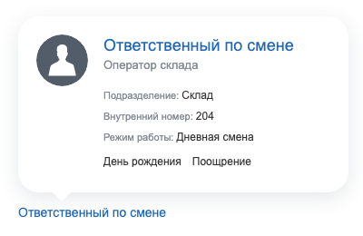
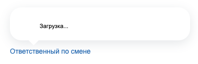
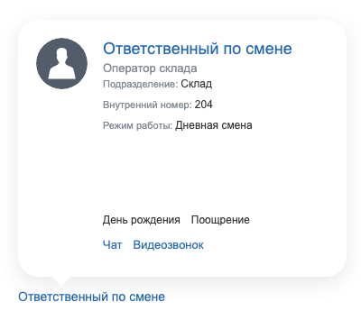
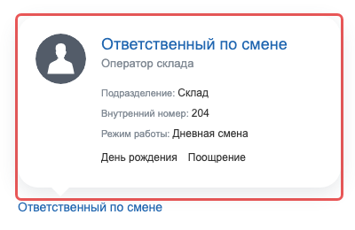

Расширение `ui.tooltip` показывает карточку пользователя, когда курсор задерживается на элементе страницы. Карточка содержит фотографию, имя со ссылкой на профиль, должность, поля профиля и кнопки чата и видеозвонка.

Разработчик размечает элемент атрибутом `bx-tooltip-user-id`, а расширение перехватывает наведение курсора, запрашивает данные и строит карточку. Вызывать JavaScript для каждого элемента не нужно.

Используйте расширение там, где на странице упоминается пользователь: автор записи, ответственный за задачу, участник обсуждения, строка списка сотрудников. Для короткого текстового пояснения к элементу интерфейса расширение не подходит — такие пояснения дает [подсказка](./hint.md).

За показ карточки отвечает JavaScript-расширение `ui.tooltip` модуля `ui`, за ее данные — компонент `bitrix:ui.tooltip` того же модуля.

## Подключить расширение

Загрузите `ui.tooltip` на странице с упоминаниями пользователей.

```php
\Bitrix\Main\UI\Extension::load('ui.tooltip');
```

Если карточка нужна внутри своего расширения, добавьте `ui.tooltip` в список зависимостей `rel` файла `config.php`. Состав файла описан в статье [Расширения](../framework/extensions.md).

При загрузке расширение один раз подписывается на событие `mouseover` документа. Обработчик проверяет атрибуты у элемента, над которым оказался курсор, поэтому разметка, добавленная на страницу позже, работает без повторной инициализации.



Настройка `allow_tooltip` модуля `socialnetwork` со значением `N` отключает расширение целиком: его файлы не подключаются, и карточка не появится ни на одном элементе. По умолчанию настройка равна `Y`, но мастера установки готовых решений — интернет-магазина и корпоративного сайта — переключают ее на `N`.



На Android и iOS расширение не подписывается на наведение курсора и карточку не показывает. Сценарии, где карточка — единственный способ увидеть данные пользователя, на мобильных устройствах работать не будут.

В классическом API карточку пользователя показывает функция `BX.tooltip()` модуля `main`. Она принимает идентификатор пользователя и элемент параметрами вызова, поэтому ее вызывают для каждого элемента отдельно. Подключение классической функции загружает и `ui.tooltip`. Для новой разметки берите атрибуты: расширение находит элементы само.

## Показать карточку пользователя

Передайте идентификатор пользователя в атрибуте `bx-tooltip-user-id`. Тег может быть любым: ссылка, блок, изображение.

**Пример.** Ссылка на профиль показывает карточку пользователя при наведении курсора.

```php
<?php

use Bitrix\Main\UI\Extension;

Extension::load('ui.tooltip');
?>

<a
    href="/company/personal/user/<?= $userId ?>/"
    bx-tooltip-user-id="<?= $userId ?>"
><?= htmlspecialcharsbx($userName) ?></a>
```

Слева в карточке стоит фотография, справа — имя со ссылкой на профиль, должность и поля карточки, под ними отметки о пользователе.

{width=400px height=260px}

Пустое значение атрибута отключает карточку для элемента. Этим пользуются шаблоны, где показ карточки зависит от параметра компонента: атрибут остается в разметке, а значение подставляется только при включенном параметре.

Карточка появляется не мгновенно: расширение ждет полсекунды после наведения, а затем показывает ее, когда курсор остановился на элементе на 0,3 секунды. Пока курсор находится на самой карточке, она не закрывается, поэтому по ссылкам внутри нее можно перейти.

Карточка скрывается в трех случаях:

-  курсор ушел с элемента и с самой карточки,

-  пользователь кликнул по элементу,

-  на странице открылась [боковая панель](./main-sidepanel.md).

## Что попадает в карточку

Содержимое карточки собирает компонент `bitrix:ui.tooltip` по данным профиля и настройкам сайта. Разметка элемента на состав карточки не влияет.



Штатный путь работает только на установке с модулем `socialnetwork`: действие `getData` запрашивает права пользователя через классы этого модуля. То же ограничение у штатного обработчика `/bitrix/tools/tooltip.php`. Без модуля `socialnetwork` данные карточки отдает только свой обработчик.



Данные расширение запрашивает один раз для каждого идентификатора пользователя и дальше показывает готовую разметку. Если данные изменились на сервере, в уже построенной карточке они не обновятся до перезагрузки страницы.

Когда пользователя нет или у текущего пользователя нет прав на просмотр профиля, компонент возвращает ошибку. Расширение ее не показывает: карточка остается с индикатором загрузки.

{width=400px height=130px}

Состав полей карточки задают настройки модуля `socialnetwork`: `tooltip_fields` — список полей профиля, `tooltip_properties` — список пользовательских свойств.

Кнопки чата и видеозвонка компонент добавляет при четырех условиях одновременно:

-  текущий пользователь авторизован,

-  карточка открыта не на себя,

-  профиль пользователя в карточке активен,

-  у текущего пользователя есть право на отправку сообщений.

Без модуля `im` право на отправку сообщений всегда выключено, поэтому кнопок не будет.

Кнопки встают под полями карточки. Блок полей в этом случае получает фиксированную высоту, поэтому при коротком списке полей между ними и кнопками остается пустое место.

{width=400px height=355px}

Отметки о поощрении и об отсутствии компонент получает из модуля `intranet`, отметку о дне рождения — из даты рождения в профиле.

## Настроить карточку атрибутами

Поведение карточки задают атрибуты элемента. Все они необязательные, кроме `bx-tooltip-user-id`.

-  `bx-tooltip-user-id` — идентификатор пользователя, для которого расширение строит карточку.

-  `bx-tooltip-classname` — класс внешнего контейнера карточки.

-  `bx-tooltip-params` — JSON-объект с контекстом проверки прав.

-  `bx-tooltip-loader` — адрес обработчика, который вернет разметку карточки вместо компонента `bitrix:ui.tooltip`.

-  `bx-tooltip-context` — со значением `b24` открывает мини-профиль Битрикс24 вместо стандартной карточки.

-  `bx-tooltip-mini-profile-direction` — направление, в котором открывается мини-профиль Битрикс24.

Контейнер карточки расширение добавляет в конец `body` и рассчитывает его позицию по положению элемента. Атрибут `bx-tooltip-classname` меняет класс этого контейнера целиком. Задайте через такой класс правила, которые зависят от окружения страницы, например `z-index` поверх собственного слоя интерфейса.

**Пример.** Строка сотрудника в структуре компании задает карточке собственный класс.

```html
<div
    class="structure-employee"
    bx-tooltip-user-id="42"
    bx-tooltip-classname="structure-employee-tooltip"
></div>
```

**Пример.** Стиль класса поднимает карточку над слоями структуры компании.

```css
.structure-employee-tooltip { z-index: 4500 !important; }
```

Класс применяется к внешнему контейнеру, поэтому оформление охватывает карточку целиком вместе с хвостиком.

{width=400px height=260px}

## Передать контекст проверки прав

Если установлен модуль `socialnetwork`, право на просмотр профиля компонент проверяет методом `CSocNetUser::canProfileView()`. Кроме текущего пользователя и владельца карточки метод принимает контекст — запись, из-за которой пользователь виден собеседнику. Контекст нужен для пользователей, авторизованных по почте: напрямую чужой профиль им недоступен, а в пределах общей записи ленты новостей карточка открывается.

Контекст передайте в атрибуте `bx-tooltip-params` — это JSON-объект с двумя ключами:

-  `entityType` — тип объекта. Проверка прав распознает единственное значение `LOG_ENTRY` — запись ленты новостей.

-  `entityId` — идентификатор записи ленты, целое число больше нуля.

Другие ключи объекта компонент не читает: они не влияют ни на проверку прав, ни на состав карточки.

**Пример.** Карточка автора записи открывается в контексте самой записи.

```php
<?php

use Bitrix\Main\Web\Json;

$tooltipParams = Json::encode([
    'entityType' => 'LOG_ENTRY',
    'entityId' => $logEntryId,
]);
?>

<span
    bx-tooltip-user-id="<?= $authorId ?>"
    bx-tooltip-params="<?= htmlspecialcharsbx($tooltipParams) ?>"
><?= htmlspecialcharsbx($authorName) ?></span>
```

Значение атрибута экранируйте. Расширение разбирает его как JSON, и на некорректном значении разбор прерывается ошибкой: карточка не появляется вовсе. Если в атрибуте окажется не объект, например пустой массив, расширение подставит пустой объект и покажет карточку без контекста.

## Загрузить данные своим обработчиком

Без атрибута `bx-tooltip-loader` расширение запрашивает данные у действия `getData` компонента `bitrix:ui.tooltip` и само собирает разметку карточки. Атрибут переключает расширение на другой порядок работы: оно отправляет `GET`-запрос по указанному адресу и ждет от него готовые блоки разметки.

Свой обработчик нужен там, где карточку строят по данным, которых нет в профиле пользователя. Метод `BX.UI.Tooltip.getLoader()` возвращает адрес стандартного обработчика — страницу `/bitrix/tools/tooltip.php`. Она отвечает в том же формате, поэтому годится как образец для своего обработчика.

**Пример.** Элемент берет данные карточки у обработчика в каталоге `/local`.

```html
<span
    bx-tooltip-user-id="42"
    bx-tooltip-loader="/local/tools/user-tooltip.php"
>Ответственный за позицию</span>
```

К адресу из атрибута расширение добавляет параметры запроса:

-  `USER_ID` — идентификатор пользователя из атрибута `bx-tooltip-user-id`.

-  `site` — код текущего сайта.

-  `version` — версия протокола, значение `2`.

-  `MODE` и `MUL_MODE` — режим запроса, значения `UI` и `INFO`.

-  `entityType` и `entityId` — контекст из атрибута `bx-tooltip-params`, если он задан.

Обработчик отвечает объектом с единственным ключом `RESULT`, внутри которого лежат готовые фрагменты HTML:

-  `Name` — имя пользователя, обычно ссылкой на профиль.

-  `Position` — должность.

-  `Photo` — фотография.

-  `Card` — поля карточки.

-  `Toolbar` — левый блок значков: день рождения, поощрение, отсутствие.

-  `Toolbar2` — правый блок кнопок: чат и видеозвонок.

-  `Scripts` — массив строк с кодом, который расширение выполнит после вставки разметки.

**Пример.** Ответ обработчика с именем, должностью и одним полем карточки.

```json
{
  "RESULT": {
    "Name": "<a href=\"/user/42/\">Ответственный</a>",
    "Position": "Оператор склада",
    "Photo": "",
    "Card": "<span>Подразделение: Склад</span>",
    "Toolbar": "",
    "Toolbar2": "",
    "Scripts": []
  }
}
```



Ответ обработчика расширение выполняет как код, а содержимое ключей вставляет в разметку как HTML. Адрес в `bx-tooltip-loader` задавайте статически в шаблоне и не собирайте его из данных, которые пришли от пользователя.



Пустой ответ расширение не обрабатывает: карточка остается с индикатором загрузки.

## Открыть мини-профиль Битрикс24

В Битрикс24 вместо стандартной карточки работает мини-профиль из расширения `intranet.user.mini-profile`. Чтобы открыть его, добавьте элементу атрибут `bx-tooltip-context` со значением `b24`.

```html
<div class="task-user" bx-tooltip-user-id="42" bx-tooltip-context="b24"></div>
```

Расширение `ui.tooltip` подключает мини-профиль само, если модуль `intranet` установлен и содержит службу мини-профиля. Если мини-профиль недоступен или в `bx-tooltip-user-id` стоит не число, расширение показывает стандартную карточку. Отдельно проверять в шаблоне, какой продукт установлен, не нужно.

Атрибут `bx-tooltip-mini-profile-direction` со значением `viewport` разворачивает мини-профиль по границам окна браузера. Любое другое значение расширение отбрасывает и открывает мини-профиль в направлении по умолчанию. Атрибут работает только вместе с `bx-tooltip-context="b24"`.

## Отключить карточку на время

Класс `BX.UI.Tooltip` управляет показом карточек на всей странице.

#|
|| **Метод** | **Описание** ||
|| `disable()` | Запрещает показ карточек. Уже открытая карточка остается на экране, новые не появляются ||
|| `enable()` | Снова разрешает показ карточек ||
|| `getDisabledStatus()` | Возвращает `true`, если показ карточек запрещен ||
|| `getLoader()` | Возвращает адрес стандартного обработчика данных ||
|| `getIdPrefix()` | Возвращает приставку идентификаторов: к ней расширение добавляет идентификатор пользователя и получает `id` элемента с карточкой ||
|#

Запрет нужен на время операций, которым карточка мешает: перетаскивания элемента, выделения мышью, показа собственного всплывающего окна над тем же элементом.

**Пример.** Карточки не появляются, пока пользователь перетаскивает строку списка сотрудников.

```js
import { Event } from 'main.core';
import { Tooltip } from 'ui.tooltip';

const list = document.getElementById('employee-list');

Event.bind(list, 'dragstart', () => {
    Tooltip.disable();
});

Event.bind(list, 'dragend', () => {
    Tooltip.enable();
});
```

## Подписаться на события

Расширение отправляет три глобальных события. В совместимых данных приходит объект карточки — экземпляр класса `TooltipBalloon`. Получить его можно методом `getCompatData()`.

#|
|| **Событие** | **Когда срабатывает** ||
|| `onTooltipShow` | При показе карточки, после вставки заготовки разметки на страницу ||
|| `onTooltipInsertData` | При вставке в карточку данных, которые вернул компонент или свой обработчик ||
|| `onTooltipHide` | При скрытии карточки ||
|#

Событие `onTooltipShow` приходит раньше ответа с данными, а `onTooltipInsertData` — после него. Если обработчику нужны имя, должность или поля карточки, подписывайтесь на оба события: при повторном наведении разметка уже готова и данные заново не запрашиваются.

Событие `onTooltipHide` расширение отправляет на каждом шаге затухания карточки — три раза подряд на одно закрытие. Пишите обработчик так, чтобы повторный вызов ничего не ломал.

**Пример.** Обработчик дописывает в карточку блок с дополнительными данными и снимает выделение с элемента при ее закрытии.

```js
import { EventEmitter } from 'main.core.events';
import { Dom, Tag } from 'main.core';

EventEmitter.subscribe('onTooltipInsertData', (event) => {
    const [ tooltip ] = event.getCompatData();

    Dom.append(
        Tag.render`<div class="storage-tooltip-note">Доступ к складу открыт</div>`,
        tooltip.DIV,
    );
});

EventEmitter.subscribe('onTooltipHide', (event) => {
    const [ tooltip ] = event.getCompatData();

    Dom.removeClass(tooltip.node, 'storage-user-selected');
});
```

Свойство `DIV` объекта карточки — контейнер с ее содержимым, свойство `node` — элемент страницы, на который навели курсор.

## Связанные материалы

-  [Подсказка](./hint.md) — короткие пояснения к элементам интерфейса.

-  [Всплывающие окна и меню main.popup](./main-popup.md) — всплывающие окна общего назначения.

-  [Боковая панель main.sidepanel](./main-sidepanel.md) — панель, открытие которой закрывает карточку.

-  [Расширения](../framework/extensions.md) — подключение JavaScript-расширений Bitrix Framework.
